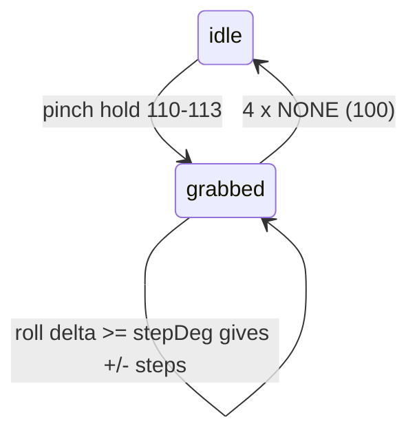

# Knob (pinch-hold + twist)

**v2 (`TapSDKWeb2`) only.** It needs air-gesture holds and IMU roll, which v1 does not provide. This is the same interaction as the Knob in the TAP_EV sandbox (https://tapwithus.github.io/TAP_EV/).

## How it works

1. The user holds a pinch: `AB_HOLD`..`AE_HOLD` (codes 110-113). That **grabs** a knob. Each pinch is a separate knob, so one hand controls 4 values.
2. While the pinch is held, the wrist **roll** from IMU motion turns the knob. The roll at grab time is the reference. Every `stepDeg` of roll away from it is one step (+ or -).
3. The user relaxes the hand. After `releaseAfter` consecutive `NONE` (100) packets, the knob is **released**. Waiting for several packets stops one noisy packet from dropping the grab.



## Use the template

Copy [scripts/knob.ts](scripts/knob.ts). `KnobTracker` is pure logic, with no Bluetooth. It is easy to test and reuse.

- `onGesture(code)` returns `"start"`, `"release"`, or `null`.
- `onRoll(roll)` returns signed int steps (0 when idle).
- `active` is the knob index 0-3 (AB, AC, AD, AE) or `null`.

Required device setup after `connect()` and after you register callbacks. `connect()` already started notifications. There is no `start()`.

```typescript
await sdk.setFeature(DeviceFeatures.MODEL_DETECTION, true);
await sdk.setVisionSensorModel(ModelTypes.AIR_GESTURE);
await sdk.setVisionSensorOpMode(VisionSensorOpModes.STREAM);
await sdk.setFeature(DeviceFeatures.IMU_MOTION_DATA, true);
```

If `connect()` does not return a v2 SDK, tell the user the knob needs a v2 device.

Wiring:

```typescript
const knob = new KnobTracker(2);
const value = [50, 50, 50, 50];

function onAirGesture(_identifier: string, data: number[]): void {
    const event = knob.onGesture(data[0]);
    if (event === 'start') {
        void sdk.sendVibrationSequence([40]);
    }
}

function onMotion(_identifier: string, motion: ImuMotionData): void {
    const roll = motion[3][0];
    const steps = knob.onRoll(roll);
    if (steps && knob.active !== null) {
        const i = knob.active;
        value[i] = Math.max(0, Math.min(100, value[i] + steps));
    }
}
```

## Tuning

| Setting | Default | Effect |
|---------|---------|--------|
| `stepDeg` | 1 (template uses 2) | Degrees of roll per step. Larger = slower, more precise. 1-2 for fine values, 5-10 for menu items. |
| `releaseAfter` | 4 | `NONE` packets before release. Raise it if the knob drops while still pinching. |

- If the direction feels inverted, use `-steps`.
- Give a short haptic on grab (`sendVibrationSequence([40])`) and optionally a tick every N steps. Do not buzz on every step.
- Clamp values (`Math.max(0, Math.min(100, v))`).
- Roll wraps at +/-180. `wrapDegrees` handles crossing it.

## Ideas

- Four properties of one object on the page: AB = size, AC = brightness, AD = opacity, AE = roundness (what the TAP_EV cube sandbox does).
- Scroll a list: one step = one item, with `stepDeg = 8`.
- The page cannot change the OS volume. Change a value on the page, or play louder Web Audio.

See also `tap-dpad` (pinch-hold that chooses between rotate and drag) and `tap-vision-models` (gesture codes).
